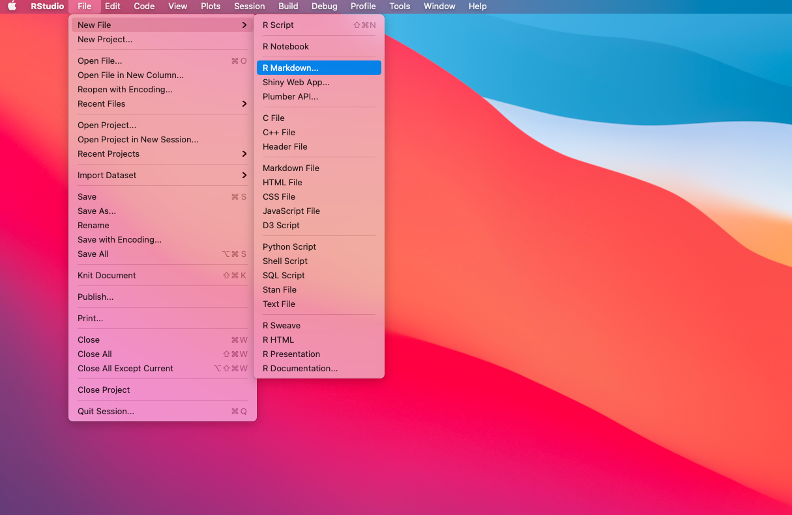
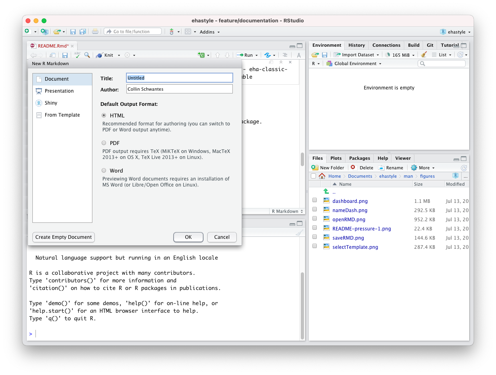
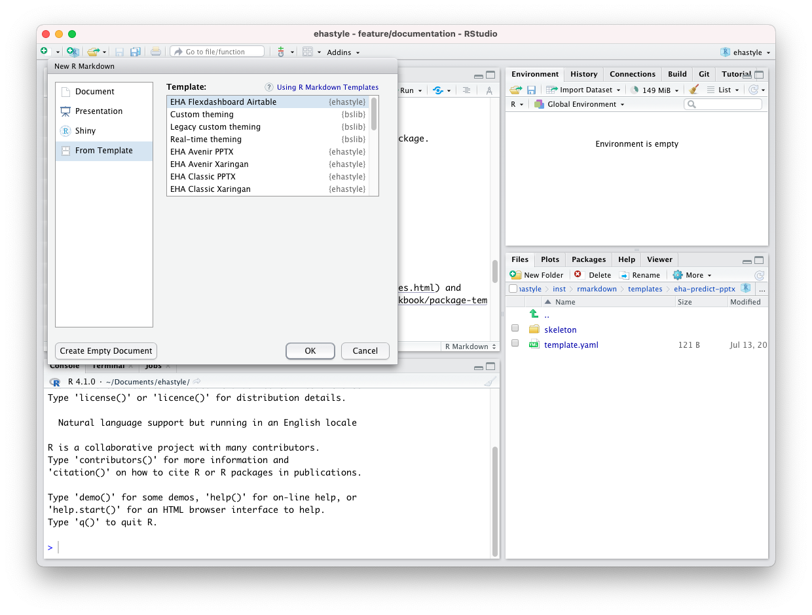
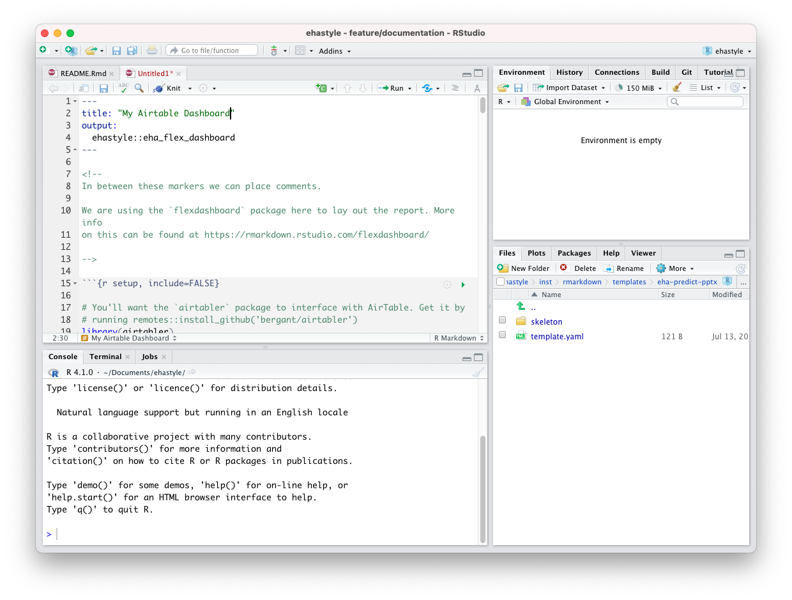
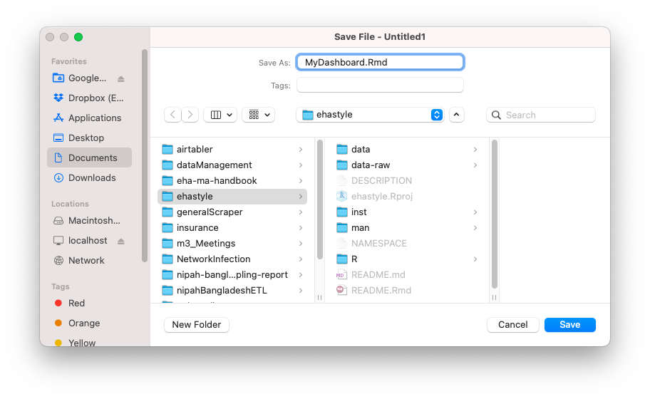
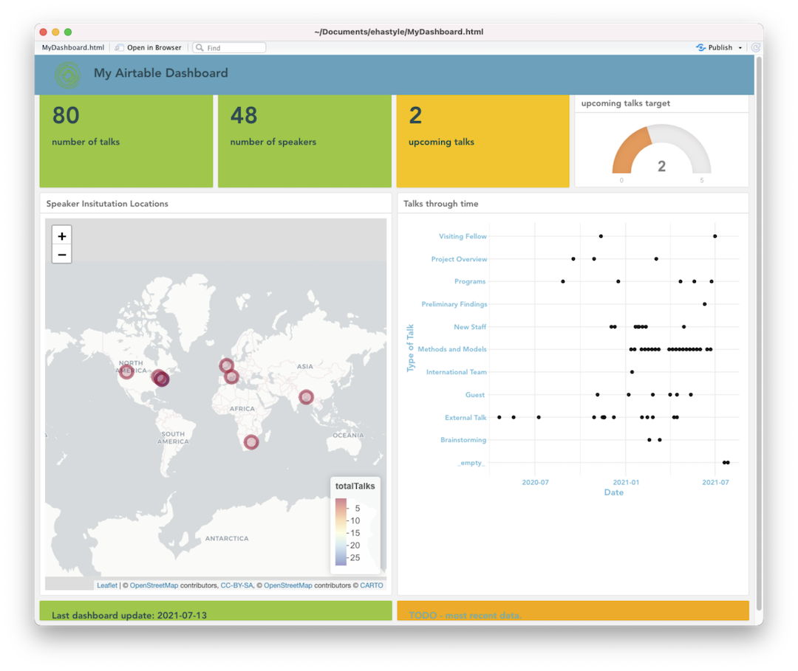

<!-- README.md is generated from README.Rmd. Please edit that file -->

# ehastyle

<!-- badges: start -->
<!-- badges: end -->

R Markdown templates for EcoHealth Alliance presentations, dashboards,
and reports.

## Why use rmarkdown and templates?

The biggest advantage of rmarkdown is that it allows you to dynamically
generate content. That means plots, tables, text, etc will change as
your code or data change. For example, you are working on a presentation
for a conference and continually refining the plots. If you build your
presentation in rmarkdown then export to powerpoint (ppt), you won’t
have to worry about having the most up-to-date plot or have to deal with
managing a folder full of presentation\_plot\_final\_final.png type
files. Your plots will be stored in your presentation and update along
with your code and data.

The next super power using rmarkdown gives you is reproducibility.
Because your code and content are stored in a single .rmd file, it is
easy to track exactly how a figure is being generated and to share the
file with collaborators. If you track your file with version control
([GIT](https://happygitwithr.com/)), then you will also be able to see
how your document has changed through time and who has made those
changes.

By using templates, we can produce consistently styled content across
the organization with minimal effort. As style guides change, we can
update the templates and retroactively change the styling of content
with a single line of code.


## Installation

Install the development version from [GitHub](https://github.com/) with:

``` r
# install.packages("devtools")
devtools::install_github("ecohealthalliance/ehastyle")
```

## Example

The functions in this package are generally used in the `yaml` of
rmarkdown documents.

``` r
---
title: "EHA Presentation"
subtitle: "EHA Subtitle"
author: Your Name
output:
  ehastyle::eha_classic_pptx:
    aspect: 16x9
---
```

You can use `rmarkdown::draft` to create files from the templates in the
package.

``` r
rmarkdown::draft(file = "myfile.rmd",template = "eha-classic-pptx", package = "ehastyle")
```

The package currently contains the following templates:

-   eha-avenir-pptx
-   eha-avenir-xaringan
-   eha-classic-pptx
-   eha-classic-xaringan
-   eha-predict-pptx
-   eha-xaringan
-   flexdash-airtable

## How to use rmarkdown templates

There are two ways to use the templates contained in this package.

0. Restart rstudio after installing the package

1.  Use the Rstudio GUI

-   Open a markdown file
    

-   Click on the **from template** option



-   Select the template you would like to use
    

-   Modify the template
    

-   Knit and save your content
    

-   Revel in the glory of your creation
    

2.  Use `rmarkdown::draft`

-   Start with `rmarkdown::draft` then follow the same steps as above

``` r
rmarkdown::draft(file = "myfile.rmd",template = "eha-classic-pptx", package = "ehastyle")
```

See [R Markdown: The Definitive
Guide](https://bookdown.org/yihui/rmarkdown/document-templates.html) and
[Markdown
Cookbook](https://bookdown.org/yihui/rmarkdown-cookbook/package-template.html)
for more information.

## Slide presentations

This package contains `classic`, `avenir`, and `predict` presentation
templates that can be used with an aspect ratio of `16x9` or `4x3` to
generate ppt or html based slides.

Functions follow this form `eha_template_output`. For
example`eha_avenir_xar` will generate html based slides using the
[{xaringan}](https://bookdown.org/yihui/rmarkdown/xaringan.html) package
and the avenir font.

`classic` will always contain the standard slide theme as defined by our
communications professionals.

`avenir` will contain a variation of `classic` that uses the avenir
font.

`predict` contains a legacy template from EcoHealth Alliance’s work with
USAID predict.

Other templates will be added as needed.

## Dashboards

This package currently contains a single function and template for
creating
[{flexdashboard}](https://rstudio.github.io/flexdashboard/index.html)
rmd documents.

`Flexdashboards` allow you to create dashboards with ease. You can embed
static or dynamic plots or elements without having to learn rshiny.

## Hosting Fonts on AWS

The Avenir font used in the different templates is currently hosted on
AWS instance in an S3 bucket called `font-avenir`. There are two files,
one is a woff2 font file and the other is a css document describing the
font face. This workflow could be adapted for other templates that
require a custom/proprietary font.

See: <https://blog.arrowtype.com/host-webfont-on-aws/>
